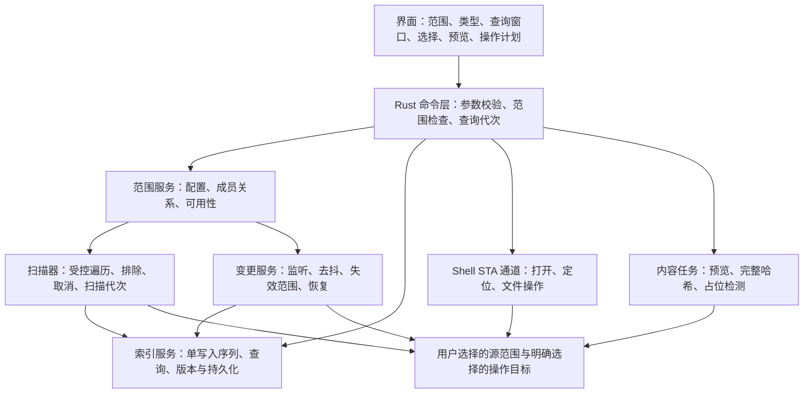

# FileM 方案审查与修订

日期：2026-09-12。状态：设计审查稿，未开始应用开发。

原文见 [FileM_原始需求.md](FileM_原始需求.md)，排期和验收见 [FileM_开发计划.md](FileM_开发计划.md)。本文保留原稿的产品方向，修正实现约束；技术选型和数值目标均为建议，不代表已经通过 Windows 实测。

## 1. 审查结论

**方向成立，可以进入有明确验收条件的原型验证。正式实现前，应先修正索引一致性、范围语义和真实文件操作三部分。**

建议保留：用户显式指定范围、默认目录遍历且无需管理员、扩展名聚合与默认目录列、离线索引、虚拟滚动、按大小预筛后完整哈希。

建议调整：Rust + Tauri 2 作为首选验证路线；先实现可靠的遍历与恢复，再交付批量操作、预览和重复检测。MFT、USN 加速、完整第三方右键菜单兼容、RAW/EXIF 等垂直功能延后。持久化建议从 SQLite 事务批写开始验证，不在缺少基准数据时直接承担自定义存储引擎的维护成本。

当前 FileM 工作目录只有 Git 元数据，没有应用代码。此次仅核对需求、官方文档及结构大小计算，未进行 Windows API、扫描速度、内存、Shell 或界面运行验证。

## 2. 需要修正的 16 项问题

P0：可能漏索引、越界或误操作，必须在相关功能进入可用版本前解决。P1：影响完整性、兼容性或架构成本。P2：需要用基准数据替代推断。

| 编号 | 级别 | 原稿问题 | 修订决策 |
| --- | --- | --- | --- |
| R01 | P0 | “位置与内容完全不变”与真实移动、重命名、删除混在一起 | 区分只读聚合与用户主动发起的真实操作；移除范围、隐藏文件绝不操作磁盘文件 |
| R02 | P0 | 启动时依靠父目录 mtime 剪枝，可能漏掉深层变化和原地写入 | 无连续可靠日志时完整遍历授权范围的元数据；mtime 只能用于调度提示 |
| R03 | P0 | 初次扫描与监听之间存在事件窗口；溢出处理不完整 | 先挂监听、再扫描、最后对账；零字节完成和溢出都进入恢复流程 |
| R04 | P0 | 嵌套范围的排除优先级、移除后的归属不明确 | 按每个范围独立计算成员关系，再选最深的有效成员范围作显示归属 |
| R05 | P0 | 路径哈希被当成唯一键，缺少文件身份、硬链接与替换检查 | 哈希碰撞时比较原始名称；区分目录项 ID 与物理文件身份 |
| R06 | P1 | 32 字节记录、10–50 MB 总内存的依据不足 | 字段本身合计 33 字节；常见 64 位 C 布局为 40 字节，总内存另算 |
| R07 | P1 | 自定义快照未定义崩溃恢复、版本和一致性提交 | 首版评测 SQLite WAL；若改用快照，补齐完整存储协议 |
| R08 | P1 | MFT/USN 的时间、续读、硬链接与事件规则不完整 | 分离枚举游标与日志游标，校验日志连续性，补齐元数据和目录变化处理 |
| R09 | P1 | 跨目录多选直接套用 GetUIObjectOf；归因“扩展多数只注册 Explorer” | 首版提供明确的常用命令；原生菜单另做兼容性验证 |
| R10 | P0 | 批量操作只列 API，没有部分失败和恢复语义 | 预览、逐项执行结果、取消、冲突处理和可验证的恢复记录必须同时设计 |
| R11 | P0 | 云占位文件只在打开或批量操作前提示 | 扫描、缩略图、预览和哈希均遵循不自动取回内容的策略 |
| R12 | P1 | 虚拟滚动被当成大数据量界面的充分条件 | 查询、过滤和排序留在 Rust；分页 IPC、稳定选择、取消旧查询一起实现 |
| R13 | P2 | O(1) 查询与固定扫描、排序耗时表述过度 | 仅桶定位平均 O(1)；枚举、过滤、排序和输出均有与结果规模相关的成本 |
| R14 | P1 | 长路径、UTF-8 字符串池和路径小写化缺少兼容性边界 | 保存可无损还原的 Windows 名称，分别处理 Win32 路径与 Shell 路径 |
| R15 | P1 | 在线状态只有 bool；权限拒绝可能被当成删除 | 区分离线、拒绝访问、待校验、部分完成；重连校验根身份 |
| R16 | P1 | 技术选型以其他产品的用户抱怨推导框架性能 | 删除无证据归因，在 Windows 上验证端到端首屏、滚动与总内存 |

### R01：定义“不移动文件”的适用范围

建议把核心目标替换为：

> FileM 只对用户明确添加的范围建立元数据索引，按文件类型提供虚拟聚合。扫描、筛选、排序、分组和移除范围不主动修改源文件内容或位置。只有用户明确提交打开、重命名、复制、移动、回收等操作时，才调用对应系统能力。

“源文件不变”不宜扩大为“系统完全没有磁盘写入”：索引本身需要写入应用数据目录，系统或云服务也可能更新访问记录。打开文件后的行为由目标应用决定。

“范围之外完全不触碰”也需要可实现的精确定义：不枚举范围外的文件树，不读取其文件内容，不对其自动执行操作。文件系统可能为解析路径访问祖先元数据；这不等于索引祖先目录。原稿建议监听范围根的父目录会接收范围外兄弟项的信息，首版改成检查已授权根的可用性；父目录监听只有在另行明确允许时才启用。用户选择范围外的复制/移动目标时，仅获得本次目标操作权限，不自动将其加入索引范围。

### R02：目录 mtime 不能作为“整棵子树未变化”的证据

反例：退出应用后修改 `D:\Assets\A\B\image.psd`，顶层 `D:\Assets` 的 mtime 未必改变；文件原地写入也不能通过祖先目录时间可靠推知。只在顶层时间改变时递归，就可能永远保留过期大小、时间或文件列表。

微软资料描述的是具体目录条目发生变化，文件时间还受文件系统、缓存和显式时间设置影响。**据此作出的设计判断是：目录 mtime 不提供递归子树完整性的保证。**不能把“多数情况有效”用作正确性条件。[目录变更示例](https://devblogs.microsoft.com/oldnewthing/20180712-00/?p=99225)、[File Times](https://learn.microsoft.com/en-us/windows/win32/sysinfo/file-times)

修订：先显示上次索引并标记“校验中”。若没有覆盖停机期间的连续日志，后台重新枚举整个授权范围的目录项与必要元数据，不读文件正文。完整覆盖前不能标记“已同步”。只有连续、经校验且完整应用的 USN 日志等机制才能支持跳过相应全量校验；定期完整核对仍作为兜底。

### R03：补齐监听时序、缓冲区和恢复

`ReadDirectoryChangesW` 可递归覆盖一个根，因此“整盘时必须监听大量目录，才改用 USN”这个理由不成立。USN 的优势应表述为卷级日志、可续读与降低特定负载下的事件恢复成本。

官方明确：除 `ERROR_NOTIFY_ENUM_DIR` 外，也可能成功完成但返回零字节；异步调用要从完成通知读取字节数，不能读未定义的 `lpBytesReturned`。网络目录的缓冲区不可超过 64 KB。原文“64 KB 起”不能通用于网络盘。[ReadDirectoryChangesW](https://learn.microsoft.com/en-us/windows/win32/api/winbase/nf-winbase-readdirectorychangesw)

修订状态流程见第 4 节。200 ms 去抖是可调调度参数；它不意味着文件已写完，也不能把同名路径上的删除、重建、重命名随意合并成一次修改。恢复重扫范围应覆盖丢失事件的整个监听范围，除非已有独立证据能够证明更小范围足够。

### R04：嵌套范围使用“成员关系＋显示归属”

只存一个 `scope_id` 不够：同一文件可能同时满足父、子范围的规则。建议如下，属于产品规则提案：

1. 每个范围独立判断路径是否在根内、递归层数和排除规则是否允许。
2. 文件对所有有效范围保留成员关系；聚合列表按同一目录项去重。
3. 默认“所属范围”显示有效成员中根最深者；筛选某个范围时按成员关系，而非仅按显示归属。
4. 子范围排除某文件，而父范围允许时，文件仍出现在父范围中；“排除”只影响本范围。“在所有视图隐藏”是独立动作。
5. 删除子范围不删除父范围仍覆盖的记录；删除范围只删除配置与无其他归属的索引引用。
6. 同一根的别名重复添加时，依据根身份提示已经添加；不同根的包含关系仅提示，不自动合并配置。

例如：A=`D:\Assets`，B=`D:\Assets\Final`。`Final\logo.psd` 同时属于 A、B，列表只显示一次，显示归属 B。B 排除 `*.psd` 后，它仍属于 A，显示归属变为 A。A 排除 `Final/**`、B 允许时，仍可由显式添加的 B 索引。

### R05：身份、哈希碰撞与可变路径

`(dir_id, name_hash)` 只能定位候选桶，不能唯一判等，否则碰撞会覆盖或错删记录。应保留原始名称进行最终比较。路径也会被删除后重建、大小写更名或经不同别名访问。

建议区分：`EntryId` 标识应用中的目录项；`FileIdentity` 表示可获取时的卷身份与文件 ID。硬链接具有不同目录项、相同物理文件身份，应显示为多个路径，但不作为多份实际占用空间重复累计。按物理文件 ID 去重所有列表项也不正确，会隐藏合法路径。路径别名、硬链接、不同内容副本是三个概念。[FILE_ID_INFO](https://learn.microsoft.com/en-us/windows/win32/api/winbase/ns-winbase-file_id_info)

真实操作前重新解析当前目录项与文件身份，发现同路径文件已替换时要求重新预览。部分网络文件系统无法提供等价的稳定身份，需要标记能力不足并保守复核。重命名目录会影响整棵子树路径、排除结果与范围成员关系。不能只更新单条文件记录。

`Vec` 下标不作为对外 ID：紧缩、删除、重新扫描后应保持应用 ID 可验证，或者使旧 ID 明确失效。前端选择必须携带索引代次，防止同一行号指向另一文件。

### R06：修正内存模型

原始字段合计：`4 + 4 + 2 + 2 + 1 + 4 + 8 + 8 = 33` 字节。按常见 64 位、8 字节对齐的 C 布局计算为 40 字节。Rust 默认布局不能当成稳定磁盘格式；目标编译器上的大小应通过 `size_of` 检查，不能承诺 32 字节。[Rust 类型布局](https://doc.rust-lang.org/reference/type-layout.html)

此次用审查机器上的 Python `ctypes` 检查同字段 C 布局，结果为 40 字节、对齐 8；这不是 Windows Rust 编译结果。按 40 字节估算，10 万条记录本体约 4 MB、100 万条约 40 MB，均未包含其他开销。

还需计入名称池、目录表、范围成员关系、哈希表容量、倒排表、排序数组、墓碑、预览缓存、扫描中的暂存代次、序列化缓冲及 WebView2 进程。仅一个百万项 `u32` 下标数组就约 4 MB。全体名称是否可去重、平均长度多大，应由样本统计。不能直接给出全应用 10–50 MB 的承诺。

`scope_id: u8` 只有 256 个取值；范围生命周期与复用也未定义。建议持久配置使用稳定 ScopeId，运行时需要紧凑槽位时另做映射。`u16` 扩展名字典、`u32` 字符串池偏移均需要边界检查，不允许溢出后截断。

### R07：不要提前断言 SQLite 不适用

“SQLite 在百万级写入必然不合适”缺少同负载比较。逐行提交与批量事务的成本不同，WAL 也不等于没有 checkpoint 和持久性取舍。建议首版评测本地应用目录中的单数据库：按 ScopeId 逻辑分区、批量写入、读写分离、必要索引；避免把索引数据库本身放在网络共享。[SQLite WAL](https://sqlite.org/wal.html)

内存倒排与数据库索引并非必须同时全量维持；先测 SQL 过滤分页与内存查询的实际收益。若后续采用每范围二进制快照，必须定义格式版本、编码、边界校验、校验和、临时文件写入后原子替换、旧代次保留、恢复策略，以及范围内所有字典的保存方式或重建规则。

“每范围独立文件”与“全局 ext_id/name_pool/记录下标”不能直接组合：快照需要自包含局部 ID，加载时重映射；或以全局 manifest 协调一致代次。USN 游标必须与已落盘索引原子对应，绝不能游标已前移、索引仍是旧版本。

### R08：修正 MFT / USN 路径

原稿“枚举前取得日志位置”应保留，但它只是完整流程的一步：

- 卷级枚举不直接提供任意目录的遍历接口；第一版只对用户明确添加的整卷启用，避免为了一个文件夹枚举全卷。提权加速延后，普通 UI 保持普通权限。
- 分开保存 MFT 枚举的文件引用续枚举位置与 USN 日志的 `NextUsn`；解析 `RecordLength`、版本和名字长度并做边界检查，不能混用两种游标。[FSCTL_ENUM_USN_DATA](https://learn.microsoft.com/en-us/windows/win32/api/winioctl/ni-winioctl-fsctl_enum_usn_data)
- `USN_RECORD_V2` 有 `TimeStamp` 字段，但那是记录时间，不是文件最后修改时间；也没有文件大小字段。原稿应改为“不能从该记录获得完整的文件大小和 mtime”，而不是笼统称结构没有时间戳。[USN_RECORD_V2](https://learn.microsoft.com/en-us/windows/win32/api/winioctl/ns-winioctl-usn_record_v2)
- 枚举结果父目录可能尚未出现，先建立或延迟解析父链，再做归属判断。单个父引用也不能代替完整的硬链接路径清单。
- 重启续读须校验卷身份、Journal ID、游标与当前可用日志区间，并处理读取失败、日志重建或截断；任何不连续都进入重新校验，不能声称“重启不丢变更”。[USN_JOURNAL_DATA_V0](https://learn.microsoft.com/en-us/windows/win32/api/winioctl/ns-winioctl-usn_journal_data_v0)
- 原因码补充截断、基础属性/时间变更、旧名与目录变化；CLOSE 可以帮助归并，但不是应用级事务提交或“所有写入已结束”的承诺。[USN 记录语义](https://learn.microsoft.com/en-us/openspecs/windows_protocols/ms-fscc/d2a2b53e-bf78-4ef3-90c7-21b918fab304)

日志禁用或容量不足时，首版回退目录校验即可，不自动更改系统日志设置。能力探测失败应可继续使用普通扫描。

### R09：系统右键菜单与跨目录聚合不是简单直连

`IShellFolder::GetUIObjectOf` 接收相对同一父文件夹的子项标识，不能把来自多个目录的相对 PIDL 直接拼在一起。聚合多选应使用合适的 Shell 项集合和数据对象表示。[GetUIObjectOf](https://learn.microsoft.com/en-us/windows/win32/api/shobjidl_core/nf-shobjidl_core-ishellfolder-getuiobjectof)

首版常用菜单：打开、在资源管理器中定位、复制路径、重命名、复制/移动、放入回收站、属性。完整原生菜单作为单独能力验证，再逐步覆盖同目录多选与跨目录多选。保留“在资源管理器中定位”作为入口。

原稿关于第三方扩展“多数只注册到 Explorer”的比例判断没有证据，应删除。实际兼容性需要按菜单接口、宿主、系统版本、扩展位数等建立测试矩阵，不能承诺完全等同 Windows 11 Explorer。拖拽也需真实 `IDataObject` 和效果协商，HTML `dragstart` 不等于 Windows Shell 文件拖拽。

### R10：IFileOperation 不等于完整的批量事务和撤销

使用独立、带消息循环的 STA Shell 执行通道；不能把 COM 对象直接投给任意 Rust 异步工作线程。官方要求 `IFileOperation` 运行在 STA。[IFileOperation](https://learn.microsoft.com/en-us/windows/win32/api/shobjidl_core/nn-shobjidl_core-ifileoperation)

`PerformOperations` 成功仍可能发生取消，必须检查 `GetAnyOperationsAborted` 并通过逐项进度回调记录实际结果。批次可能部分成功，不应把整个操作标记为原子事务或自动回滚。[GetAnyOperationsAborted](https://learn.microsoft.com/en-us/windows/win32/api/shobjidl_core/nf-shobjidl_core-ifileoperation-getanyoperationsaborted)

删除默认请求系统回收，配置相应标志；不同目标与设备的回收能力仍需实测。不能无声降级成永久删除，回收不可用就停止该项并说明。系统 undo 标志不构成应用跨重启、任意时刻的可靠撤销协议。[SetOperationFlags](https://learn.microsoft.com/en-us/windows/win32/api/shobjidl_core/nf-shobjidl_core-ifileoperation-setoperationflags)

应用恢复记录应包含原位置、实际目标、结果及身份；逆向移动/重命名前重新检查身份、目标占用及权限。跨卷移动、外部修改、覆盖和回收后的恢复都可能受限，界面逐项显示“可恢复 / 需处理冲突 / 不支持”。首版不自动覆盖，不自动永久删除。已有目录项被同路径新文件替换时，旧计划失效。

### R11：占位文件保护覆盖所有内容读取

批量哈希、缩略图、预览也可能打开文件，因此仅对“双击”提示不足。元数据索引阶段不请求文件正文；占位文件默认不生成需要内容的预览、不参与自动哈希。用户明确请求读取后，展示可能下载的项目与已知逻辑大小，再进行内容操作。

不要把所有 reparse point 都当成需要跳过的符号链接：云占位文件也可能使用重解析点，目标是索引可用元数据但不自动取回内容。目录符号链接/Junction 默认不跟随，云目录按提供者能力单独判断；无法无下载枚举的子树标记未扫描。

官方的 OFFLINE、RECALL_ON_OPEN、RECALL_ON_DATA_ACCESS 等标志可作为判断输入；尤其 RECALL_ON_OPEN 在文档中限定了枚举信息来源，不能假设任意属性读取 API 都能等价反映状态。具体云服务行为应在 Windows 上验证。[File Attribute Constants](https://learn.microsoft.com/en-us/windows/win32/fileio/file-attribute-constants)

### R12：前端只持有当前查询窗口

Tauri 的 Rust 与 WebView 之间存在消息边界。即使 DOM 虚拟化，把百万记录一次发送到 JS 仍会产生序列化、内存和主线程开销。[Tauri IPC](https://v2.tauri.app/concept/inter-process-communication/)

修订：Rust 执行过滤、排序、计数并返回当前页和索引代次；WebView 保留有限行缓存。查询带请求序号，可取消、丢弃旧响应。排序键增加稳定 ID 作为同值时的次级键。选中状态绑定 EntryId；“选择全部匹配项”用后端冻结的查询选择表示，不能只选当前已渲染 DOM。

缩略图按 EntryId、版本和所需尺寸缓存，并限制并发、像素数与缓存容量；滚动到屏外应取消或降级低优先级请求。外部变更导致查询代次变化时，要重新验证批量选择与操作计划。

### R13：性能承诺改成可复测目标

扩展名哈希表桶定位平均 O(1)，读取 k 个匹配结果仍需 O(k)；逐个范围/大小/路径过滤也有成本。比较排序通常为 O(k log k)，受排序字段和比较方式影响。它们不能概括为“查询与总量无关、筛选成本忽略不计”。

`FIND_FIRST_EX_LARGE_FETCH` 请求较大的内部目录查询缓冲，并不是用户每次调用直接收到一批数组；应用仍需正常枚举。线程数不应简单等于 CPU 核数：SSD、机械盘、SMB 的合适并发不同，使用有上限、可调度、可取消的队列。[FindFirstFileExW](https://learn.microsoft.com/en-us/windows/win32/api/fileapi/nf-fileapi-findfirstfileexw)

原稿的“万级不到一秒”“百万排序百毫秒”“差异快一到两个数量级”全部移出事实描述。基准必须注明 CPU、内存、磁盘、文件系统、目录分布、文件数量、是否冷缓存、杀毒软件、云占位比例与构建模式。

### R14：名称与路径需要无损往返

Windows 原生字符串可以包含普通 UTF-8 `String` 无法无损表达的序列；身份和操作路径使用 `OsString/PathBuf` 或无损宽字符表示。展示字符串可另行转换，不能从有损显示名称反向构造实际操作路径。[Rust Windows 字符串](https://doc.rust-lang.org/std/os/windows/ffi/index.html)

长路径分别处理本地绝对路径与 UNC 扩展形式，不能给所有字符串机械加 `\\?\`。Win32 文件访问与 Shell 的支持边界也不同，必须分别测试长路径的扫描、打开、移动与定位。[Windows 长路径限制](https://learn.microsoft.com/en-us/windows/win32/fileio/maximum-file-path-limitation)

路径包含判断按组件和实际根身份执行，不能用字符串前缀把 `D:\Work2` 判成 `D:\Work` 的子目录。不能无条件把全部路径小写后去重；Windows 支持按目录设置大小写敏感性。扩展名展示可以独立采用产品规定的大小写归一策略。[Windows 目录大小写敏感性](https://learn.microsoft.com/en-us/windows/wsl/case-sensitivity)

### R15：状态模型不能只有 online

建议分别存储可用性与索引新鲜度：

| 维度 | 状态 | 含义 |
| --- | --- | --- |
| 可用性 | available / offline / access_denied / missing / identity_changed | 能否访问、是否仍是原来的根 |
| 新鲜度 | unscanned / scanning / verifying / current / dirty / partial | 当前索引是否完整并已核对 |
| 监听 | enabled / disabled / recovering / unsupported | 是否具备实时更新能力 |

扫描拒绝访问的子目录时，保留已有记录并标记该区域不完整，不能依据“没扫到”就全部删掉。外置盘重连除检查盘符，还要比对卷与根身份；相同盘符可能对应另一设备。没有父目录监听时，根的移动可能表现为不可用，重新定位由用户选择。

### R16：技术路线用端到端原型决策

Rust 适合承接索引和 Win32 桥接；Tauri 2 适合复用网页界面。但语言选择不自动保证扫描速度，包体积小也不代表运行内存小。评测需包含 Rust 主进程与关联 WebView2 进程，并验证安装、启动、缩放和输入。

推荐首选 Rust + Tauri 2，不同时开发 Slint、C++ 或纯浏览器三套产品。如果 Tauri 在后端分页、合理缓存和虚拟化之后仍不满足已确认目标，再选择性验证替代 UI。原稿对 WinUI 3/.NET 和 Files 产品的因果归因应删除；产品实测可以淘汰方案，未经复现的抱怨不能代替基准。

## 3. 修订后的模块边界

前端通过有限的命令访问文件能力。Tauri capability 配置是边界的一部分，自定义 Rust 命令仍需检查 EntryId、范围成员关系、目标授权及计划版本，不能相信前端传来的任意路径。[Tauri capabilities](https://v2.tauri.app/security/capabilities/)

建议数据模型是逻辑模型，不锁定当前 Rust struct 的字段顺序：

| 实体 | 关键字段/关系 |
| --- | --- |
| Scope | 稳定 ID、原始路径、根身份、排除配置、递归/监听、配置版本、可用性与新鲜度 |
| Directory | 内部 ID、父目录、无损名称、可获取的文件身份、最近完整扫描代次 |
| Entry | 稳定 ID、父目录 ID、无损名称、扩展名、逻辑大小、mtime、属性、版本、隐藏状态 |
| ScopeMembership | ScopeId 与 EntryId/DirectoryId 的关系或等价可计算表示；显示归属由规则计算 |
| FileIdentity | 卷身份与文件 ID，允许未知；与目录项不是一对一关系 |
| ScanRun | ScopeId、代次、配置版本、已覆盖目录、失败区域、是否发生事件丢失 |
| Operation | 操作 ID、冻结的计划、来源身份与版本、实际目标、逐项结果、恢复条件 |
| HashResult | 文件身份/版本、算法、逻辑流大小、完整哈希、稳定性状态 |

小规模先使用易验证的表示；需要压缩时再用字符串池或紧凑数组，避免同时维护多个未经验证的“权威来源”。物理已分配空间与逻辑大小是不同字段，首版文件列表可只展示逻辑大小。

## 4. 修订后的扫描与恢复协议

### 4.1 首次扫描和无可续读日志的启动

1. 加载上次索引，显示离线/待校验状态；校验配置版本、根身份和读权限。
2. 在可监听的范围挂接监听器，开始记录序列化事件或受影响目录；监听不可用则明确降级。
3. 创建扫描代次，通过受控并发枚举范围；在进入子目录前应用排除与链接规则。流式结果标记扫描中，不冒充最终完整结果。
4. 扫描和监听事件经过同一索引写入协调器。事件对相关路径重新读取当前元数据，而不是盲目执行历史“创建/删除”指令。
5. 仅对已完整遍历且未受丢失事件影响的目录执行未见项清理。拒绝访问、断线、取消的区域不作删除推断。
6. 处理扫描期间积累的变更，建立有顺序的切换点；切换后的事件继续由实时处理器接收。文件系统停止变化后，结果应收敛到当前状态。普通遍历不声称是磁盘原子快照。
7. 代次对账结束且覆盖完整才进入 current。任一步发现队列丢失、配置改变或根身份改变，废弃不可靠的完成判断并重新恢复。

### 4.2 运行中变更

新增目录或整棵目录移入时扫描其子树；移出时撤销相关成员关系；目录重命名更新父链并重算受影响排除规则。编辑器的临时文件替换、文件删除后重建、大小写更名分别处理。属性变化触发占位状态与必要元数据失效。

缓冲溢出、应用事件队列超限或重新连接后，将监听范围置为 dirty，并执行覆盖范围的核对。持续高频写入时进行背压、合并核对任务并显示恢复中，不能反复无界创建全量扫描。

### 4.3 排除与递归语义

规则统一以相对范围根的路径解释，配置中用 `/` 分隔；定义 `*` 匹配单段、`**` 跨目录，裸名称规则可用于匹配任意层同名目录或文件。目录命中排除时剪枝，裸 `*.tmp` 匹配各层文件名。首版不提供否定规则，以免剪枝后无法重新包含；如以后支持，需要重新定义遍历策略。

默认规则保留原稿意图，但 UI 展示实际生效的规则及匹配例子；`Windows/WinSxS` 这类根相对规则在根为 `D:/Projects` 时自然不会命中。`recursive=false` 只收集根下直接文件，不进入子目录。根本身是链接时，展示解析后的目标，由用户明确选择实际监视目标；不得静默跨范围跟随链接。

## 5. 修订后的查询与操作规则

默认列沿用原稿：文件名、范围内相对目录、大小、修改时间、扩展名、所属范围。单范围时隐藏所属范围。悬停或详情展示完整路径；离线与部分索引状态须可见。文件名搜索只搜索名称/路径，不加入正文全文检索。

扩展名大小写在分类层归一；无后缀和 `.gitignore` 等只有前导点的名字归入“无扩展名”；复合扩展名 `tar.gz` 可作为明确配置功能，默认规则不得隐含变化。用户分组改变只改变分类，不触发磁盘操作。多组含同一扩展名时允许多标签，但“全部”总数始终按目录项去重，分组数之和不一定等于文件总数。

批量动作统一为：**选中 → 创建计划 → 展示路径和冲突 → 用户提交 → 操作前再验证 → 逐项记录 → 更新受影响索引 → 显示结果与恢复能力**。来源变化、目标变化或权限变化使相关计划项失效；操作队列重启后显示待核对，不自动重放。

“从视图隐藏”只写入索引配置，并提供“显示已隐藏项”和恢复显示。不能与“回收文件”共用含糊的“删除”按钮。复制到范围外只执行本次用户目标，移动出所有范围的成功项从索引移除；监听回声应幂等处理。

重复检测：范围及过滤条件冻结 → 按逻辑大小分桶 → 对实际不同文件身份的候选流式完整哈希 → 对变化中的文件重试或标记无法确认。块采样只作预筛，不能代替完整哈希。默认跳过占位、不可访问及离线项并显示数量。

“完全重复”首版精确定义为默认数据流字节相同；不声称 ACL、备用数据流、扩展属性等也完全相同。破坏性清理前再次确认来源版本与保留副本，必要时重新哈希/逐字节比较；时间和大小未变不应单独作为内容相同的证明。硬链接不重复估算空间；可释放空间仅是估计，不能把逻辑大小简单相加后保证释放。

疑似版本组保留为后续候选能力：`v2`、日期、“最终版”、mtime 都只是线索，不自动决定主版本，也不自动清理。

## 6. 进入开发时的默认决策

| 决策 | 建议默认值 | 何时改变 |
| --- | --- | --- |
| 产品形态 | Windows 桌面应用，Tauri 网页界面 | 用户另行选择纯浏览器形态时重定范围与能力 |
| 权限 | 普通用户权限；用户显式添加范围 | 整卷优化阶段再设计受限提权通道 |
| 索引 | 目录遍历＋监听＋完整元数据核对兜底 | 有可靠、连续日志且通过断点恢复测试后优化 |
| 存储 | 先验证本地 SQLite WAL 与事务批写 | 同一基准证明其不达标且快照方案收益足够时 |
| 范围关系 | 独立成员关系，最深有效范围作为显示归属 | 真实使用反馈需要全局排除时单独增加产品规则 |
| 真正文件写入 | 预览后提交；无静默覆盖；回收不可用则停项 | 永久删除等能力另列版本需求 |
| 原生菜单/拖拽 | 常用命令先可用，完整兼容独立验收 | 核心批量闭环已可靠后 |
| 性能 | 先明确样本与测量口径，不承诺未经实测的数字 | P0 原型产出基线后冻结可用版本门槛 |

原稿关于 Everything 或保存搜索的一到两周验证，可与技术原型并行，用来确认“找到后批量处理”的痛点，不设成必须等待两周才允许开发的前置流程。
